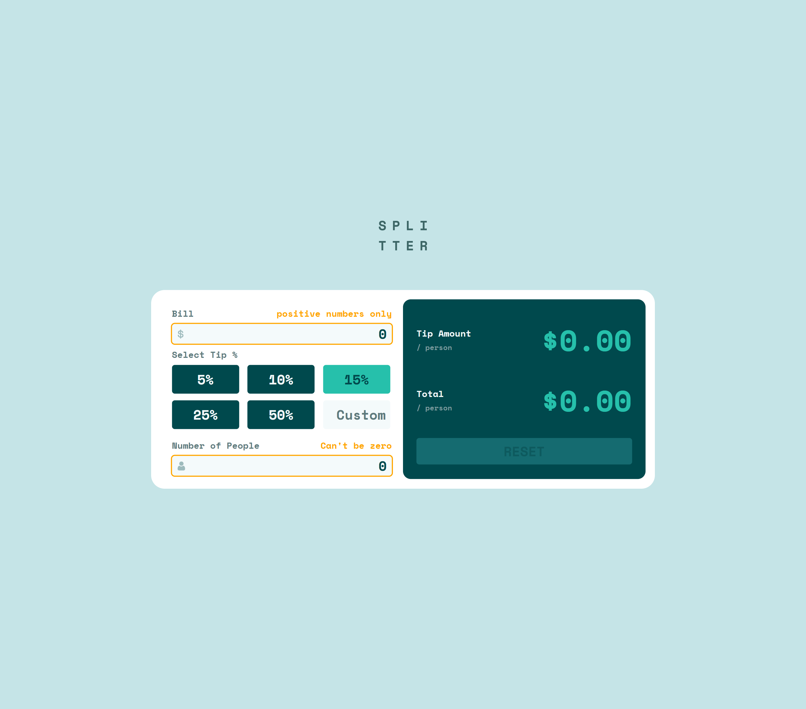

# Frontend Mentor - Tip calculator app solution

This is a solution to the [Tip calculator app challenge on Frontend Mentor](https://www.frontendmentor.io/challenges/tip-calculator-app-ugJNGbJUX). Frontend Mentor challenges help you improve your coding skills by building realistic projects.

## Table of contents

- [Overview](#overview)
  - [The challenge](#the-challenge)
  - [Screenshot](#screenshot)
  - [Links](#links)
- [My process](#my-process)
  - [Built with](#built-with)
  - [What I learned](#what-i-learned)
  - [Continued development](#continued-development)
  - [Useful resources](#useful-resources)
- [Author](#author)

## Overview

This project is a responsive tip calculator app built as part of a Frontend Mentor challenge. It allows users to input a bill amount, select or enter a custom tip percentage, and specify the number of people splitting the bill. It then calculates and displays the tip amount per person and the total amount per person. The goal of the project is to practice modern frontend development techniques, including responsive design, interactive UI elements, and clean, maintainable code.

### The challenge

Users should be able to:

- View the optimal layout for the app depending on their device's screen size
- See hover states for all interactive elements on the page
- Calculate the correct tip and total cost of the bill per person

### Screenshot

### Links

- Solution URL: 
- Live Site URL: 

## My process

1. **Planning:** I started by reviewing the challenge requirements and designing the app layout.
2. **Setup:** Initialized the project and set up the folder structure for all the files.
3. **Function Development:** Broke down the UI into reusable functions.
4. **Styling:** Used Styled Components for modular and maintainable CSS, focusing on responsive design for mobile and desktop.

### Built with

- Semantic HTML5 markup
- CSS custom properties
- Flexbox
- CSS Grid
- Mobile-first workflow
- JavaScript

### What I learned

During this project, I deepened my understanding of user input validation in JavaScript. I learned how to handle dynamic form inputs, tip buttons and provide total outputs to users. For example, I implemented logic to prevent division by zero when the number of people is set to zero:

I also improved my skills in responsive design using CSS Grid and Flexbox, ensuring the layout adapts smoothly across devices. Additionally, I practiced using Styled Components for modular and maintainable styling, which made it easier to manage styles for different UI states.

Overall, this project reinforced the importance of clean code structure, user experience considerations, and modular component design.

### Continued development

In future projects, I want to continue focusing on:

- **Accessibility best practices:** Ensuring my apps are usable by everyone, including users with disabilities.
- **Performance optimization:** Learning techniques to make my apps faster and more efficient, particularly for mobile devices.

These are areas where I see room for growth and want to deepen my skills as I take on new challenges.

### Useful resources

- [Refactoring your code](https://www.frontendmentor.io/learning-paths/javascript-fundamentals-oR7g6-mTZ-/steps/684feaab52709e9eee0f7fba/article/read) - This article provides practical tips and strategies for improving the structure and readability of JavaScript code, making it easier to maintain and scale.
- [Deepseek](https://chat.deepseek.com/) - An advanced language model designed to assist developers in generating and completing code. Built on a massive 2 trillion-token dataset, its stands out by delivering state-of-the-art performance.

## Author

- Frontend Mentor - [@remainhumble](https://www.frontendmentor.io/profile/remainhumble)
- X(formerly Twitter) - [@thiflan120699](https://x.com/thiflan120699)
